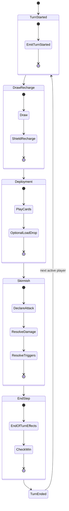

# Halo: Combat Evolved TCG
# 事件总线与触发器系统规范（V1.0）

> 目标：为规则引擎提供**可确定、可回放、可扩展**的事件驱动架构，支持 1v1 / FFA / 2v2 与轨道-地表双层战场。

---

## 1. 设计原则

- **确定性优先**：同一输入序列必须产生同一结果（便于重放与排错）。
- **事件单一来源**：所有规则触发都从 EventBus 出发，避免隐式副作用。
- **队列化异步**：触发器不直接改全局状态，而是投递后续事件到队列。
- **优先级固定**：同类结算顺序固定，防止卡牌文本互相“抢时机”。
- **多人可追踪**：每个事件必须带 `globalTurnIndex` 与 `ownerTurnCount`。

---

## 2. 完整事件枚举（核心）

## 2.1 回合与阶段事件

- `GAME_STARTED`
- `ROUND_STARTED`（一轮：所有存活玩家都行动一次）
- `TURN_STARTED`
- `PHASE_DRAW_RECHARGE_STARTED`
- `PHASE_DRAW_RECHARGE_ENDED`
- `PHASE_DEPLOYMENT_STARTED`
- `PHASE_DEPLOYMENT_ENDED`
- `PHASE_SKIRMISH_STARTED`
- `PHASE_SKIRMISH_ENDED`
- `PHASE_ENDSTEP_STARTED`
- `PHASE_ENDSTEP_ENDED`
- `TURN_ENDED`
- `ROUND_ENDED`
- `GAME_ENDED`

## 2.2 资源与抽牌事件

- `CARD_DRAWN`
- `SUPPLY_CAP_INCREASED`
- `SUPPLY_REFILLED`
- `BATTERY_GENERATED`
- `RESOURCE_SPENT`

## 2.3 部署与位置事件

- `CARD_PLAY_DECLARED`
- `CARD_PLAY_VALIDATED`
- `CARD_PLAY_REJECTED`
- `UNIT_DEPLOYED`
- `ARMORY_ATTACHED`
- `FIELD_ACTIVATED`
- `UNIT_MOVED`
- `UNIT_REPOSITIONED`
- `ORBITAL_LOAD_QUEUED`
- `ORBITAL_DROP_RESOLVED`

## 2.4 战斗与伤害事件

- `ATTACK_DECLARED`
- `TARGET_LOCKED`
- `HIT_ROLL_RESOLVED`（若启用命中制）
- `DAMAGE_CALC_STARTED`
- `COVER_MITIGATED`
- `DAMAGE_MODIFIED`
- `SHIELD_DAMAGED`
- `HULL_OR_HEALTH_DAMAGED`
- `DAMAGE_DEALT`
- `LETHAL_CHECKED`
- `KILL_OCCURRED`
- `OVERKILL_APPLIED`
- `COMBAT_EXCHANGED`（同步互殴）

## 2.5 关键词与状态事件

- `STATUS_APPLIED`
- `STATUS_REFRESHED`
- `STATUS_STACKED`
- `STATUS_EXPIRED`
- `KEYWORD_GAINED`
- `KEYWORD_LOST`
- `PLASMA_TAG_APPLIED`
- `HEADSHOT_TRIGGERED`
- `INFECT_TRIGGERED`
- `EMP_APPLIED`
- `CAMO_BROKEN`
- `HIJACK_EXECUTED`

## 2.6 轨道层与全域战争事件

- `ORBITAL_STRIKE_DECLARED`
- `ORBITAL_STRIKE`
- `ORBITAL_STRIKE_MISSED`
- `POINT_DEFENSE_INTERCEPTED`
- `TARGET_PAINTED`
- `AA_FIRE_RESOLVED`
- `CAPITAL_SHIP_DESTROYED`
- `CAPITAL_SHIP_CRASH_RESOLVED`
- `GALACTIC_EVENT_ROLLED`
- `GALACTIC_EVENT`

## 2.7 目标与胜利事件

- `LANE_CONTROL_UPDATED`
- `OBJECTIVE_PROGRESS_UPDATED`
- `OBJECTIVE_COMPLETED`
- `BASE_DAMAGED`
- `PLAYER_ELIMINATED`
- `WIN_CONDITION_MET`

---

## 3. 事件数据模型（建议）

```java
public enum EventType {
    GAME_STARTED, ROUND_STARTED, TURN_STARTED,
    PHASE_DRAW_RECHARGE_STARTED, PHASE_DRAW_RECHARGE_ENDED,
    PHASE_DEPLOYMENT_STARTED, PHASE_DEPLOYMENT_ENDED,
    PHASE_SKIRMISH_STARTED, PHASE_SKIRMISH_ENDED,
    PHASE_ENDSTEP_STARTED, PHASE_ENDSTEP_ENDED,
    TURN_ENDED, ROUND_ENDED, GAME_ENDED,

    CARD_DRAWN, SUPPLY_CAP_INCREASED, SUPPLY_REFILLED, BATTERY_GENERATED, RESOURCE_SPENT,
    CARD_PLAY_DECLARED, CARD_PLAY_VALIDATED, CARD_PLAY_REJECTED, UNIT_DEPLOYED, ARMORY_ATTACHED,
    FIELD_ACTIVATED, UNIT_MOVED, UNIT_REPOSITIONED, ORBITAL_LOAD_QUEUED, ORBITAL_DROP_RESOLVED,

    ATTACK_DECLARED, TARGET_LOCKED, HIT_ROLL_RESOLVED, DAMAGE_CALC_STARTED,
    COVER_MITIGATED, DAMAGE_MODIFIED, SHIELD_DAMAGED, HULL_OR_HEALTH_DAMAGED,
    DAMAGE_DEALT, LETHAL_CHECKED, KILL_OCCURRED, OVERKILL_APPLIED, COMBAT_EXCHANGED,

    STATUS_APPLIED, STATUS_REFRESHED, STATUS_STACKED, STATUS_EXPIRED,
    KEYWORD_GAINED, KEYWORD_LOST, PLASMA_TAG_APPLIED, HEADSHOT_TRIGGERED,
    INFECT_TRIGGERED, EMP_APPLIED, CAMO_BROKEN, HIJACK_EXECUTED,

    ORBITAL_STRIKE_DECLARED, ORBITAL_STRIKE, ORBITAL_STRIKE_MISSED,
    POINT_DEFENSE_INTERCEPTED, TARGET_PAINTED, AA_FIRE_RESOLVED,
    CAPITAL_SHIP_DESTROYED, CAPITAL_SHIP_CRASH_RESOLVED,
    GALACTIC_EVENT_ROLLED, GALACTIC_EVENT,

    LANE_CONTROL_UPDATED, OBJECTIVE_PROGRESS_UPDATED, OBJECTIVE_COMPLETED,
    BASE_DAMAGED, PLAYER_ELIMINATED, WIN_CONDITION_MET
}

public record GameEvent(
    long sequence,
    EventType type,
    int globalTurnIndex,
    int roundIndex,
    String activePlayerId,
    String sourcePlayerId,
    String targetPlayerId,
    String sourceEntityId,
    String targetEntityId,
    String lane,
    String layer, // ORBIT / SURFACE
    java.util.Map<String, Object> payload
) {}
```

> 约束：`sequence` 全局递增；同 `sequence` 的派生事件必须保序入队。

---

## 4. 触发器优先级与伤害流水线（关键）

## 4.1 标准伤害优先级

以下顺序固定，不允许卡牌文本改写：

1. `DAMAGE_CALC_STARTED`：确定基础伤害与伤害类型。
2. `COVER_MITIGATED`：先结算 `Cover(X)` 减免（非 Ordnance 才生效）。
3. `DAMAGE_MODIFIED`：应用倍率/加减伤（`Plasma`、`Ballistic`、`Marked`、`Headshot`）。
4. `SHIELD_DAMAGED`：先扣护盾。
5. `HULL_OR_HEALTH_DAMAGED`：溢出伤害进入生命/船体。
6. `DAMAGE_DEALT`：写入本次最终伤害日志。
7. `LETHAL_CHECKED`：判定是否死亡/摧毁。
8. `KILL_OCCURRED`：触发击杀后效果（如 `Infect`、战功）。
9. 派生事件入队（如 `INFECT_TRIGGERED` 生成衍生物）。

## 4.2 示例（你提到的规则）

- 伤害结算前先检查 `Cover`。
- 再应用 `Plasma` 倍率（对盾 x2、对血 x0.5）。
- 最后在 `KILL_OCCURRED` 后触发 `Infect` 生成。

## 4.3 同步互殴规则

- 单位对战时双方先分别完成步骤 1-6。
- 收集双方结果后统一执行步骤 7-9。
- 这保证“同归于尽”可同时触发双方的击杀后效果。

---

## 5. 回合状态机（含多人全局计数）

## 5.1 计数定义

- `globalTurnIndex`：每个玩家回合开始时 +1（全局）。
- `roundIndex`：当所有存活玩家各完成一次回合时 +1。
- `ownerTurnCount[playerId]`：该玩家自己完成的回合数。

## 5.2 状态转换图（文本）

```text
[TURN_STARTED]
   -> [PHASE_DRAW_RECHARGE_STARTED]
   -> [PHASE_DRAW_RECHARGE_ENDED]
   -> [PHASE_DEPLOYMENT_STARTED]
   -> [PHASE_DEPLOYMENT_ENDED]
   -> [PHASE_SKIRMISH_STARTED]
   -> [PHASE_SKIRMISH_ENDED]
   -> [PHASE_ENDSTEP_STARTED]
   -> [PHASE_ENDSTEP_ENDED]
   -> [TURN_ENDED]
   -> next active player
```

## 5.3 Mermaid 状态机图



---

## 6. Java 实现建议：EventBus + 监听器模式

## 6.1 最小接口

```java
public interface EventListener {
    EventType supports();
    int priority(); // 数值越小优先级越高
    void onEvent(GameEvent event, EventContext ctx);
}

public interface EventBus {
    void publish(GameEvent event);
    void register(EventListener listener);
    void processQueue();
}
```

## 6.2 推荐架构

- `DeterministicEventBus`
  - 内部使用 `PriorityQueue<GameEvent>`（按 `sequence` + `phasePriority`）。
  - 监听器按 `supports + priority` 排序。
- `RuleEngine`
  - 负责“规则判断”，不直接改 UI。
  - 通过发布事件驱动状态变更。
- `ProjectionLayer`
  - 监听事件，构建回放日志、战报、UI 快照。

## 6.3 异步触发范式（击杀后衍生物）

```java
// KILL_OCCURRED listener
public final class InfectOnKillListener implements EventListener {
    public EventType supports() { return EventType.KILL_OCCURRED; }
    public int priority() { return 200; }

    public void onEvent(GameEvent event, EventContext ctx) {
        if (!ctx.hasKeyword(event.sourceEntityId(), "INFECT")) return;
        if (ctx.isVehicle(event.targetEntityId())) return;

        ctx.eventBus().publish(ctx.newDerivedEvent(
            EventType.INFECT_TRIGGERED,
            java.util.Map.of("spawnCardId", "TOKEN-COMBAT-FORM")
        ));
    }
}
```

> 关键点：监听器只“发事件”，具体创建单位由 `INfectResolveListener` 处理，保持职责单一。

---

## 7. 监听器优先级建议表

- `100-199`：合法性校验（目标、资源、停火 Truce、距离）
- `200-299`：伤害前修正（Cover、护盾硬化、减伤）
- `300-399`：伤害后修正（标记、溢出、生命写入）
- `400-499`：死亡与击杀触发（Infect、战功、坠落）
- `500-599`：回合末与目标进度（Lane 控制、战略任务）
- `900+`：日志投影/UI广播（不改规则状态）

---

## 8. 与多人/全域规则的关键兼容点

- `Truce`：在 `CARD_PLAY_VALIDATED` 与 `TARGET_LOCKED` 两处都校验，避免绕过。
- `Orbital Drop`：拆成 `ORBITAL_LOAD_QUEUED` 与 `ORBITAL_DROP_RESOLVED` 两步，便于 `Point Defense` 拦截。
- `Galactic Event`：在 `TURN_STARTED` 时检查 `globalTurnIndex % 5 == 0` 并发布 `GALACTIC_EVENT`。
- `Capital Crash`：舰毁事件不直接伤害，先发 `CAPITAL_SHIP_DESTROYED`，再由专门监听器发布 `CAPITAL_SHIP_CRASH_RESOLVED`。

---

## 9. 最小可实现里程碑（编码顺序）

1. 建立 `EventType`、`GameEvent`、`DeterministicEventBus`。
2. 跑通 4阶段回合事件链（不含轨道层）。
3. 接入伤害流水线监听器（Cover → Plasma/Ballistic → Kill）。
4. 接入 `Infect` 与 `Commendation` 的击杀触发。
5. 最后接入轨道层事件（`ORBITAL_STRIKE`、`GALACTIC_EVENT`）。

---

## 10. 验收标准（Definition of Done）

- 同一局面重放 100 次，事件序列完全一致。
- 任意一次 `DAMAGE_DEALT` 都可追溯其前置 `DAMAGE_CALC_STARTED`。
- `KILL_OCCURRED` 后触发链可追溯到具体监听器与派生事件。
- 多人局中 `globalTurnIndex / roundIndex / ownerTurnCount` 不出现错位。
- 关键规则（Cover、Plasma、Infect、Orbital Strike）都有自动化测试样例。
