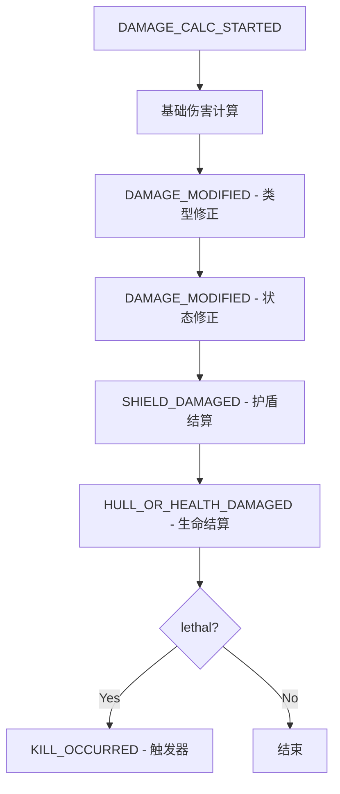

# Halo: Combat Evolved TCG
# 伤害结算流水线与修正器堆栈规范（V1.0）

> 目标：定义伤害结算的确定性流水线，保证 Plasma 倍率、Cover 减免、Marked 加伤、Headshot 条件倍率 等修正按固定顺序应用，避免平衡崩盘。

---

## 1. 设计原则

- **确定性优先**：同一输入必须产生同一输出（便于重放与排错）。
- **流水线固定**：6步顺序不可改写，卡牌文本只能在指定步骤注入修正。
- **堆栈化修正**：每个单位维护 `ModifierStack`，支持临时/永久加成。
- **同步互殴**：单位对战时双方先分别完成前5步，再统一执行第6步。
- **多人兼容**：轨道打击可叠加地面修正（如 `PAINTED` 状态）。

---

## 2. 固定流水线（6步）

伤害结算从 `DAMAGE_CALC_STARTED` 事件开始，到 `KILL_OCCURRED` 事件结束。每个步骤发布对应事件，便于监听器注入修正。

### 2.1 步骤1: 基础伤害计算（DAMAGE_CALC_STARTED）

- 输入：攻击者攻击力 + 武器修正 + 基础伤害类型。
- 输出：`baseDamage`（整数）、`damageType`（BALLISTIC/PLASMA/TRUE）。
- 修正点：攻击者关键词（如 `SENTINEL` 直接对生命）、环境加成（如 `TARGET_LINK` 提升命中）。

### 2.2 步骤2: 类型修正（DAMAGE_MODIFIED）

- 输入：`baseDamage` + `damageType`。
- 输出：`modifiedDamage`（应用类型倍率后）。
- 修正逻辑：
  - `PLASMA`：对护盾 x2，对生命/装甲 x0.5（向下取整，至少1）。
  - `BALLISTIC`：标准伤害。
  - `TRUE`：无视护盾，直接对生命/船体。
- 修正点：卡牌文本可在此步注入额外倍率（如 `Headshot` 条件 x2）。

### 2.3 步骤3: 状态修正（DAMAGE_MODIFIED）

- 输入：`modifiedDamage` + 目标状态。
- 输出：`finalDamage`（应用状态加减伤后）。
- 修正逻辑：
  - `Marked`：+1 伤害。
  - `Suppressed`：-1 伤害（最低0）。
  - `Cover(X)`：若伤害来源非 `Ordnance`，先减免 X（最低0）。
- 修正点：临时状态（如 `PAINTED` 提升轨道打击精度，但不直接改伤害）。

### 2.4 步骤4: 护盾结算（SHIELD_DAMAGED）

- 输入：`finalDamage` + 目标当前护盾。
- 输出：`shieldDamage`（实际扣护盾量）、`overflowDamage`（溢出到生命）。
- 修正逻辑：
  - 先扣护盾（上限为 `shieldCap`）。
  - 溢出部分进入步骤5。
- 修正点：护盾硬化（如舰船 `ShieldHardening(X)` 首次受伤减免 X）。

### 2.5 步骤5: 生命结算（HULL_OR_HEALTH_DAMAGED）

- 输入：`overflowDamage` + 目标当前生命/船体。
- 输出：`healthDamage`（实际扣生命量）、`lethal`（是否死亡）。
- 修正逻辑：
  - 扣生命/船体（上限为 `healthCap` 或 `hullCap`）。
  - 若生命 <=0，标记 `lethal = true`。
- 修正点：装甲减伤（如 `ARMOR` 关键字对 BALLISTIC 伤害 -1）。

### 2.6 步骤6: 触发器（KILL_OCCURRED）

- 输入：`lethal` 标记。
- 输出：派生事件（如 `INFECT_TRIGGERED`、`COMMENDATION_UPDATED`）。
- 修正逻辑：
  - 若 `lethal = true`，发布 `KILL_OCCURRED`。
  - 监听器处理击杀后效果（生成衍生物、战功加点）。
- 修正点：无（触发器不可修改伤害）。

---

## 3. 修正器堆栈机制（ModifierStack）

每个单位维护一个 `ModifierStack`，支持临时/永久修正。

### 3.1 堆栈结构

```java
public record Modifier(
    String id,           // 唯一标识，如 "plasma_tag"
    int delta,           // 加减值
    ModifierType type,   // TEMPORARY | PERMANENT
    int expiresAtTurn,   // 过期回合（TEMPORARY 必填）
    String source        // 来源，如 "card-UNSC-001"
) {}

public class ModifierStack {
    private final java.util.List<Modifier> modifiers = new java.util.ArrayList<>();

    public void add(Modifier mod) { modifiers.add(mod); }
    public void removeExpired(int currentTurn) {
        modifiers.removeIf(m -> m.type() == ModifierType.TEMPORARY && m.expiresAtTurn() <= currentTurn);
    }
    public int calculateTotalDelta() {
        return modifiers.stream().mapToInt(Modifier::delta).sum();
    }
}
```

### 3.2 应用时机

- 在步骤2/3中，`ModifierStack.calculateTotalDelta()` 叠加到伤害。
- 回合开始时，`removeExpired()` 清理临时修正。
- 持久修正（如 `ARMOR` 关键字）永不过期。

### 3.3 示例

- `Marked`：临时修正 `delta = +1`，`expiresAtTurn = currentTurn + 1`。
- `Cover(2)`：临时修正 `delta = -2`，`expiresAtTurn = currentTurn`（每回合刷新）。

---

## 4. 多人兼容：轨道打击叠加地面修正

### 4.1 轨道打击流程

- 轨道打击从 `ORBITAL_STRIKE_DECLARED` 开始。
- 若目标有 `PAINTED` 状态，伤害 x1.5（向下取整）。
- 地面修正（如 `Cover`）仍适用（轨道打击视为“非 Ordnance”）。
- 舰船 `ShieldHardening` 在步骤4生效。

### 4.2 跨层交互

- 轨道打击可触发地面单位的 `Marked` 或 `Suppressed`。
- 但地面单位不能直接“反击”轨道（除非有 `AA` 工事）。

---

## 5. 边界案例处理

### 5.1 伤害为0时是否触发击杀？

- 否。`lethal` 仅在步骤5 生命 <=0 时为 true。
- 伤害为0的攻击不发布 `KILL_OCCURRED`。

### 5.2 同步伤害如何处理互殴？

- 单位对战时：
  1. 双方分别执行步骤1-5，计算各自 `lethal`。
  2. 若双方都 `lethal = true`，同时发布 `KILL_OCCURRED`（无先后）。
  3. 击杀后效果同时触发（例如，双方都生成衍生物）。

### 5.3 其他边界

- **负伤害**：修正后伤害 <0 时，设为0。
- **溢出上限**：生命扣到0后不再扣（不负数）。
- **多部位舰船**：步骤5 按部位顺序扣（护盾发生器 → 核心舱段）。

---

## 6. Java 方法签名与骨架

### 6.1 核心类

```java
public enum DamageType { BALLISTIC, PLASMA, TRUE }
public enum ModifierType { TEMPORARY, PERMANENT }

public record DamageContext(
    String attackerId,
    String defenderId,
    int baseDamage,
    DamageType damageType,
    boolean isOrbitalStrike,
    boolean isOrdnance
) {}

public class DamageResolver {
    private final EventBus eventBus;

    public DamageResult resolve(DamageContext ctx) {
        // 步骤1: 基础计算
        eventBus.publish(new GameEvent(/* DAMAGE_CALC_STARTED */));
        int modifiedDamage = applyBaseModifiers(ctx);

        // 步骤2: 类型修正
        eventBus.publish(new GameEvent(/* DAMAGE_MODIFIED */));
        modifiedDamage = applyTypeModifiers(modifiedDamage, ctx.damageType());

        // 步骤3: 状态修正
        eventBus.publish(new GameEvent(/* DAMAGE_MODIFIED */));
        modifiedDamage = applyStatusModifiers(modifiedDamage, ctx.defenderId());

        // 步骤4: 护盾结算
        eventBus.publish(new GameEvent(/* SHIELD_DAMAGED */));
        var shieldResult = applyShieldDamage(modifiedDamage, ctx.defenderId());

        // 步骤5: 生命结算
        eventBus.publish(new GameEvent(/* HULL_OR_HEALTH_DAMAGED */));
        var healthResult = applyHealthDamage(shieldResult.overflow(), ctx.defenderId());

        // 步骤6: 触发器
        if (healthResult.lethal()) {
            eventBus.publish(new GameEvent(/* KILL_OCCURRED */));
        }

        return new DamageResult(modifiedDamage, shieldResult.damage(), healthResult.damage(), healthResult.lethal());
    }

    private int applyBaseModifiers(DamageContext ctx) { /* 实现 */ }
    private int applyTypeModifiers(int damage, DamageType type) { /* 实现 */ }
    private int applyStatusModifiers(int damage, String defenderId) { /* 实现 */ }
    private ShieldDamageResult applyShieldDamage(int damage, String defenderId) { /* 实现 */ }
    private HealthDamageResult applyHealthDamage(int overflow, String defenderId) { /* 实现 */ }
}

public record DamageResult(int finalDamage, int shieldDamage, int healthDamage, boolean lethal) {}
```

### 6.2 监听器示例（Cover 减免）

```java
public final class CoverMitigationListener implements EventListener {
    public EventType supports() { return EventType.DAMAGE_MODIFIED; }
    public int priority() { return 250; } // 步骤3

    public void onEvent(GameEvent event, EventContext ctx) {
        if (event.payload().get("isOrdnance").equals(true)) return; // Ordnance 无视 Cover

        String defenderId = event.payload().get("defenderId");
        int coverValue = ctx.getUnitState(defenderId).coverValue();
        int currentDamage = event.payload().get("damage");

        int mitigated = Math.max(0, currentDamage - coverValue);
        event.payload().put("damage", mitigated);
    }
}
```

---

## 7. 流程图（Mermaid）



---

## 8. 验收标准（DoD）

- 同一伤害上下文重放 100 次，结果完全一致。
- `Plasma` 对护盾 x2、对生命 x0.5 正确应用。
- `Cover(2)` 对非 Ordnance 伤害减免 2。
- 互殴时双方同时死亡并触发击杀后效果。
- 轨道打击可叠加 `PAINTED` 状态修正。
- 伤害为0时不触发 `KILL_OCCURRED`。
